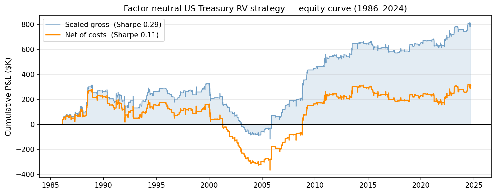
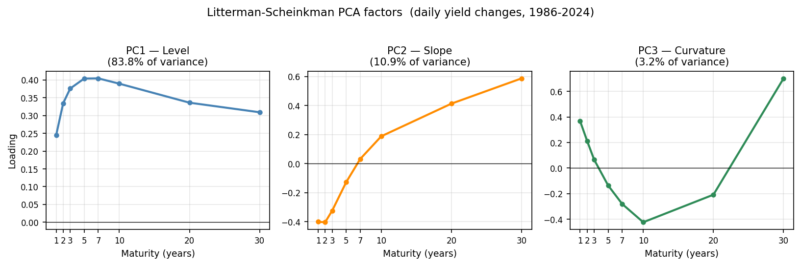

# TermStructure

A US Treasury yield-curve modeling and relative-value trading system built from scratch
in Python. Fits Svensson (1994) curves to daily bond prices, decomposes yield changes
into level/slope/curvature factors via PCA, and trades bonds whose yields deviate from
the fitted curve while neutralizing all three factor exposures through a 2Y/5Y/10Y hedge.
The full pipeline — data ingest through tearsheet — is reproducible from a single config
file with `make all`.

---

## Hero chart



---

## Results

| Metric | Scaled gross | Net of costs |
|---|---|---|
| Backtest period | 1985 – 2024 | 1985 – 2024 |
| Total P&L | $807K | $314K |
| Ann. avg P&L | $20.8K | $8.1K |
| Sharpe ratio | **0.29** | **0.11** |
| Max drawdown | $-447K | $-647K |
| Calmar ratio | 0.05 | 0.01 |
| Hit rate | 50.0% | 47.4% |
| Active days | 1,305 of 9,689 | 1,305 of 9,689 |

Cost assumption: 0.02 bp per leg per event (0.16 bp round-trip for the 4-leg
position). Hit rate counts active trading days (of 1,305) with net P&L > 0: ≈ 619
winning days ÷ 1,305 = 47.4% net; ≈ 653 winning days ÷ 1,305 = 50.0% gross. Sharpe
uses the full trading calendar including ~87% of flat/no-position days; see
Limitations.

---

## PCA factors



Three factors explain 97.8% of daily yield variance (PC1 level 83.8%, PC2 slope 10.9%,
PC3 curvature 3.2%), reproducing the Litterman-Scheinkman (1991) result on Fed GSW data.
Each trade is constructed to be exposure-neutral to all three factors simultaneously.

---

## Methodology

**Data.** Daily bond prices come from the Federal Reserve's GSW dataset
(`feds200628.csv`, 1961-present), which covers all outstanding nominal Treasury coupon
bonds. Overnight financing rates come from FRED (DFF/SOFR). The universe is filtered
to remove on-the-runs, first off-the-runs, TIPS, callables, and bonds within 90 days
of maturity — the same exclusion rules used by the Fed's published fitting procedure.

**Curve fitting.** The Svensson (1994) six-parameter model is fit daily to the filtered
bond universe using inverse-duration-weighted squared price errors minimized with
Levenberg-Marquardt (`scipy.optimize.least_squares`). Parameters are warm-started from
the previous day's solution. Fit quality targets < 2 bp RMSE, consistent with the Fed's
published GSW parameters.

**Signal construction.** For each bond, the richness/cheapness residual is
`observed_yield − fitted_zero_rate`. Residuals are demeaned per maturity to remove
structural fitting bias, then z-scored over a trailing 60-day rolling window.
Positions open when |z| > 2.0 and close when |z| < 2.0 (no look-ahead: signal on
day t enters at end-of-day t, first P&L earned from t to t+1).

**Portfolio and hedging.** Each day the top 5 cheap and top 5 rich signals at the 3Y
and 7Y maturities are selected. Every position is sized to $10,000 DV01 and hedged
with offsetting notionals in the 2Y, 5Y, and 10Y benchmarks, solving a 3×3 linear
system to neutralize level, slope, and curvature exposures exactly. Carry P&L
(coupon accrual minus repo financing at SOFR + 5 bp) is accrued daily.

---

## Reproducing the results

### Requirements

- Python 3.10+
- GNU Make 4.3+ (for grouped-target dependency tracking)

### Install

```bash
git clone https://github.com/Aarnav-Yedla/termstructure
cd termstructure
pip install -e ".[dev]"
```

### Full pipeline

```bash
make all                        # data → fit → signal → portfolio → backtest → report
```

Or stage by stage:

```bash
make data        # fetch FRED CMT yields + Fed GSW bond curves  (~5 min)
make fit         # Svensson fits (daily, 1990-2024) + zero panel + PCA  (~90 min)
make signal      # residuals → z-scores → signal panel  (~2 min)
make portfolio   # factor-neutral positions  (~5 min)
make backtest    # leg P&L + net P&L  (~1 min)
make report      # tearsheet PNG  (~10 sec)
```

Make tracks file timestamps: `make backtest` automatically rebuilds `signal` and
`portfolio` if their outputs are missing or stale (e.g., after re-fitting PCA).

### Run individual stages

```bash
python -m termstructure.run configs/base.yaml fit
python -m termstructure.run configs/base.yaml signal
```

### Tests and CI

```bash
pytest tests/ -v          # 117 tests; data-dependent tests skip if parquets absent
ruff check src/           # 0 errors
mypy src/ --strict        # 0 errors
```

GitHub Actions CI runs ruff + mypy + pytest on every push to `main`. Tests that
require processed parquets are guarded with `@pytest.mark.skipif(not path.exists())`
and skip automatically in CI without the multi-hour data files.

### Configuration

All pipeline parameters live in `configs/base.yaml`:

```yaml
cost_bps:       0.02    # per leg per event (0.16 bp round-trip)
position_scale: 0.80    # haircut for unmodeled slippage

signal:
  window:  60           # rolling z-score window (trading days)
  entry_z: 2.0          # entry threshold

portfolio:
  target_dv01: 10000.0  # DV01 per signal leg ($)
  n_per_side:  5        # max longs / max shorts simultaneously
```

---

## Data sources

| Dataset | Source | Coverage |
|---|---|---|
| Treasury bond prices | [Fed GSW feds200628.csv](https://www.federalreserve.gov/pubs/feds/2006/200628/200628abs.html) | 1961 – present |
| Overnight rate (SOFR/DFF) | [FRED DFF](https://fred.stlouisfed.org/series/DFF) | 1954 – present |
| CMT benchmark yields | [FRED DGS2/5/10/30](https://fred.stlouisfed.org/series/DGS10) | 1962 – present |

No API keys required. All data is freely available from official US government sources.

---

## Limitations

**Transaction costs are the binding constraint.** At the headline assumption of
0.02 bp per leg per event, total costs over 40 years are $807K − $314K = $493K.
At a realistic 1 bp round-trip per leg (0.5 bp/event, consistent with off-the-run
Treasury bid-ask spreads), costs scale by a factor of 0.5 ÷ 0.02 = 25×, yielding
$493K × 25 ≈ $12.3M in total costs — roughly 15× scaled gross P&L of $807K. The
0.02 bp figure is closer to electronic on-the-run execution; off-the-run spreads
of 0.5–2 bp make the strategy unviable at this size without a substantially larger
signal.

**Signal lives on par-bond approximations.** The z-score residual is
`observed_par_yield − Svensson_zero_rate(maturity)`. Par yields and zero rates are
close but not identical; the residual conflates true richness/cheapness with the
par-zero basis. A more precise signal would use stripped zero rates directly.

**Regime conditioning is diagnostic, not production.** Regime classification across
volatility, rate-direction, and curve-shape dimensions was built and used analytically:
the strategy remains profitable across all three volatility terciles (Sharpe: Low
0.10, Med 0.27, High 0.02 — all positive; both the 2013 taper tantrum and the 2022
hiking cycle produced net gains). The regimes that post negative risk-adjusted
returns are rising-rate months (net P&L −$38.7K, Sharpe −0.03) and steep-curve
months (net P&L −$27.2K, Sharpe −0.02), not high-vol months.
An exit-band hysteresis change motivated by this analysis
initially appeared promising — gross Sharpe improved from 0.11 to 0.32 — but was
rejected after IEF beta validation showed it broke factor neutrality (IEF beta became
statistically significant at p=0.03, vs p=0.58 for the baseline). The correct fix —
periodic hedge re-solving during open positions rather than holding entry-day hedge
weights fixed — was identified but not implemented. The production strategy therefore
holds constant parameters regardless of regime.

**Thin signal universe.** Only the 3Y and 7Y maturities are traded. Extending to the
full 1Y–30Y grid would increase diversification and average holding period, both of
which improve the cost economics.

**Flat-day Sharpe inflation.** Excluding no-position days from the Sharpe denominator
inflates the ratio by roughly 2.7× (√(1/0.13), where 13% is the fraction of active
trading days). All reported Sharpe figures use `expand_to_full_calendar` to reindex
P&L to every zero-panel date, filling zero for flat days; the same function is used
consistently across the codebase and tearsheet.

**Data history vs. live performance.** The GSW dataset uses a smoothed Svensson curve;
our in-sample refitting on the same bonds introduces a mild look-ahead at the fitting
step (we use the full day's cross-section rather than a real-time estimate available
at market close).
